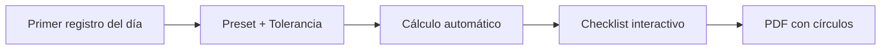

# 📋 MÓDULO MOBPER - PLANEACIÓN COMPLETA
## Sistema de Regularización de Asistencias Quincenal

> **Versión:** 2.0 - Actualizada con reglas de negocio confirmadas  
> **Fecha:** 30 de enero de 2026  
> **Diseño:** Mobile-First con código de colores

---

## 🎯 PRINCIPIOS RECTORES

### ✅ Regla de Oro: NUNCA MODIFICAR EL FORMATO

1. **Plantilla inmutable:** El archivo Excel `F-RH-18-MIT-FORMATO-DE-MOVIMIENTO-DE-PERSONAL-3(1).xlsx` es sagrado
2. **Solo rellenar:** Escribir en celdas específicas y marcar círculos
3. **PDF sellado:** El producto final es un PDF con overlay de círculos
4. **Auditoría total:** Cada decisión queda registrada (qué, quién, cuándo, por qué)

---

## 📱 PRODUCTO FINAL

### Un módulo de regularización quincenal que:



1. 🔍 **Toma** el primer registro del día desde BioStar
2. ⚙️ **Aplica** preset de horario + tolerancia + descansos + inhábiles
3. 🧮 **Calcula** incidencias automáticas (A_TIEMPO/RETARDO/FALTA)
4. ✏️ **Presenta** checklist para clasificar (justificado, remoto, guardia, etc.)
5. 📄 **Genera** PDF final rellenando formato + pintando círculos

---

## ⚙️ PRESETS: AUTOMATIZACIÓN AL 100%

### 🎨 Código de Colores para UI

- 🟢 **Verde:** A tiempo (no requiere acción)
- 🟡 **Amarillo:** Retardo (requiere justificación)
- 🔴 **Rojo:** Falta (requiere justificación)
- 🔵 **Azul:** Día inhábil (informativo)
- ⚪ **Gris:** Día de descanso (informativo)

### 📝 Preset por Usuario

**Tabla:** `PresetUsuario`

| Campo | Tipo | Ejemplo | Descripción |
|-------|------|---------|-------------|
| `user_id` | INT | 123 | ID del usuario |
| `nombre_formato` | VARCHAR | "Raul Abel Cetina Pool" | Nombre completo para el documento |
| `departamento_formato` | VARCHAR | "TI" | Departamento para el documento |
| `jefe_directo_nombre` | VARCHAR | "Juan Pérez" | Nombre del jefe que autoriza |
| `hora_entrada_default` | TIME | 09:00:00 | Hora de entrada estándar |
| `tolerancia_segundos` | INT | 600 | **10 minutos para TODOS** |
| `dias_descanso` | JSON | [6,7] | Sábado/Domingo (varía por área) |
| `lista_inhabiles` | JSON | ["2026-01-01", ...] | Días festivos oficiales |
| `modo_redondeo` | ENUM | "EXACTO" | Segundos exactos (evita discusiones) |
| `vigente_desde` | DATE | 2026-01-01 | Inicio de vigencia |
| `vigente_hasta` | DATE | NULL | Fin de vigencia (NULL = activo) |

**🔧 Comportamiento:**
- Se guarda **1 vez** y se reutiliza cada quincena
- Se puede **editar** para actualizar (guarda el último)
- Siguiente quincena: **abrir → revisar → generar**

### 🔄 Excepciones por Fecha

**Tabla:** `ExcepcionHorario`

| Campo | Tipo | Ejemplo | Descripción |
|-------|------|---------|-------------|
| `user_id` | INT | 123 | ID del usuario |
| `fecha` | DATE | 2026-01-15 | Día específico |
| `hora_entrada_override` | TIME | 10:00:00 | Hora de entrada excepcional |
| `tolerancia_override_segundos` | INT | 600 | Tolerancia (opcional, usa preset si NULL) |
| `motivo` | VARCHAR | "Junta temprano" | Razón de la excepción |

**📌 Regla:**
- Si existe excepción para ese día → **manda sobre el preset**
- Tolerancia se mantiene del preset (o se override si se especifica)
- **Se configura manualmente desde el checklist**

---

## 🧮 MOTOR DE CÁLCULO DE INCIDENCIAS

### 📊 Flujo de Decisión

```
Para cada día D en la quincena:

┌─────────────────────────────────────┐
│ 1. ¿D es día inhábil?               │
│    SÍ → 🔵 INHABIL (no aplica)      │
│    NO → Continuar                   │
└─────────────────────────────────────┘
           ↓
┌─────────────────────────────────────┐
│ 2. ¿D es día de descanso?           │
│    SÍ → ⚪ DESCANSO (no aplica)      │
│    NO → Continuar                   │
└─────────────────────────────────────┘
           ↓
┌─────────────────────────────────────┐
│ 3. D es LABORAL                     │
│    ¿Tiene checada?                  │
│    NO → 🔴 FALTA                     │
│    SÍ → Continuar                   │
└─────────────────────────────────────┘
           ↓
┌─────────────────────────────────────┐
│ 4. Comparar hora de checada         │
│    checada <= límite → 🟢 A_TIEMPO  │
│    checada > límite → 🟡 RETARDO    │
└─────────────────────────────────────┘
```

### 🔍 Paso 1: Clasificación del Día

**Antes de ver checadas:**

| Condición | Resultado | Color | Acción |
|-----------|-----------|-------|--------|
| D ∈ inhábiles | 🔵 INHABIL | Azul | No aplica, no se justifica |
| weekday(D) ∈ descanso | ⚪ DESCANSO | Gris | No aplica |
| Ninguna anterior | 🟨 LABORAL | - | Continuar análisis |

### 🕐 Paso 2: Primer Registro del Día

```python
primer_registro = MIN(timestamp) WHERE fecha = D AND evento = 'ACCESS_GRANTED'
# Zona horaria: America/Merida (Yucatán)
# Solo eventos GRANTED de BioStar
```

**📌 Regla confirmada:**
- Solo importa la **primera checada del día**
- Múltiples checadas → se ignoran (segunda es para salida)
- Sin checada → `primer_registro = None`

### ⏰ Paso 3: Hora Objetivo y Límite

```python
# Hora objetivo (con excepción si existe)
hora_obj = ExcepcionHorario.hora_entrada_override ?? PresetUsuario.hora_entrada_default

# Límite con tolerancia (10 minutos = 600 segundos)
limite = hora_obj + 600 segundos

# Ejemplo:
# hora_obj = 09:00:00
# limite = 09:10:00
```

### ✅ Paso 4: Estado Automático

| Condición | Estado | Color | Descripción |
|-----------|--------|-------|-------------|
| LABORAL + sin registro | 🔴 **FALTA** | Rojo | Inasistencia |
| LABORAL + registro ≤ límite | 🟢 **A_TIEMPO** | Verde | Llegó a tiempo |
| LABORAL + registro > límite | 🟡 **RETARDO** | Amarillo | Llegó tarde |

**🔒 Garantía:** Determinista, reproducible y auditable.

4) Checklist rápido (UX que no estorba)

Tu UI debe mostrar solo lo que importa:

RETARDO y FALTA (y opcional un colapsable con “A tiempo”)

Cada fila:

Fecha

Hora entrada detectada / “Inasistencia”

Estado auto

Selector (una sola acción):

Retardo no justificado

Retardo justificado

Falta no justificada

Falta justificada

Falta justificada por trabajo remoto

Falta justificada por guardia telefónico

Otro (requiere comentario)

Mejores prácticas para velocidad

preselección automática:

RETARDO → “retardo no justificado”

FALTA → “falta no justificada”

atajos:

“Aplicar a todos los retardos: retardo justificado”

“Aplicar a todas las faltas: remoto”

validaciones:

si eliges “Otro” → comentario obligatorio

si día es INHABIL/DESCANSO → bloqueado “No aplica”

5) Persistencia: que quede “a prueba de auditoría”

Guarda dos cosas:

5.1 Snapshot crudo (lo que el sistema vio)

MovPerPeriodo

movper_id

user_id

periodo_inicio, periodo_fin

preset_id usado (o hash del preset)

fuente_asistencia (bd, biométrico, etc.)

raw_daily_first_checkins (JSON: fecha → hora/None)

raw_daily_status_auto (JSON: fecha → A_TIEMPO/RETARDO/FALTA/…)

created_by, created_at

✅ Esto garantiza que aunque cambie el algoritmo mañana, lo de hoy queda replicable.

5.2 Decisión final (lo que el usuario seleccionó)

MovPerIncidencia

movper_id

fecha

tipo_final (enum: RETARDO_JUSTIFICADO, FALTA_REMOTO, FALTA_GUARDIA, NO_JUSTIFICADO, etc.)

comentario

edited_by, edited_at

5.3 Audit Trail (obligatorio si quieres “nivel dios”)

Cada cambio en una incidencia genera un log:

antes → después

usuario

timestamp

razón (opcional)

La idea de mantener audit trail + control de acceso + revisiones es una práctica recomendada para integridad y cumplimiento en sistemas HR.

6) Generación del PDF (SIN mover el formato)

Aquí está lo más importante: cómo lo haces sin depender de que Excel tenga “circulitos editables”.

Estrategia robusta (la que menos falla)

Paso A — Rellenar el Excel plantilla (tu .xlsx)

Escribes en celdas específicas (sin cambiar diseño)

En tu archivo, el mapeo clave (ya lo identifiqué en la hoja FORMATO):

Nombre: rango E8:M8

Departamento: Q8:R8

Fecha autorización: H10:L10

Fecha aplicación: P10:R10

Motivo: G20:R21

Paso B — Exportar a PDF en servidor

Usas LibreOffice/soffice headless para convertir xlsx→pdf (estable y estándar en automatizaciones).

Paso C — “Pintar circulitos” ya en el PDF final (overlay)
Como los círculos del formato suelen ser shapes, openpyxl no los controla bien.
Solución: crear una capa (overlay) con ReportLab dibujando círculos rellenos en coordenadas exactas y luego “stampear” sobre el PDF final con pypdf.

ReportLab permite dibujar círculos rellenos (canvas.circle(..., fill=1)).

pypdf soporta overlay/stamping (merge_page, stamping over=True).

✅ Esto es “imbatible”: aunque el Excel cambie internamente shapes, tu stamp en PDF siempre cae donde debe.

Calibración 1 vez

Necesitas medir una sola vez las coordenadas (x,y) de:

Para faltar

Para llegar tarde

Goce de sueldo Sí/No

etc.

Eso lo guardas en:
PdfStampMap

template_version

field_name (ej CHK_PARA_LLEGAR_TARDE)

page

x, y

radius

color (normalmente negro)

Y listo: nunca más se toca.

7) Cómo construir “Fecha de aplicación” y “Motivo” EXACTO como RH lo quiere
7.1 Fecha de aplicación

No pongas rango 1–15.
Pones la lista de días que realmente entran al documento, ejemplo:
1,2,5,6,7,8,9,12,13,14,15 de enero

Regla:

incluir días con incidencia final (RETARDO/FALTA) según checklist

excluir A_TIEMPO, DESCANSO, INHABIL

7.2 Campo MOTIVO (texto consolidado)

Agrupas por tipo_final y conviertes a texto:

lista 1 día: 1ro

lista 2 días: 13 y 14

lista 3+ días: 2,5,6,7...

Plantillas cerradas (para que siempre salga igual):

{dias} retardo justificado.

{dias} falta justificada.

{dias} falta justificada, trabajo remoto.

{dias} falta justificada, guardia telefónico.

Eso coincide con tu ejemplo real del formato.

8) Seguridad y mejores prácticas (para que sea “enterprise”)

Idempotencia: si generas 2 veces el mismo movper, no debe duplicar incidencias; debe “reemplazar versión” o crear version=2 con historial.

Versionado de plantilla: guarda hash del xlsx y del pdf generado.

Control de acceso:

empleado puede generar borrador

jefe aprueba (firma/folio si aplica)

Backups + retención: PDFs finales + JSON snapshot (auditable)

Validación de zona horaria: todas las comparaciones en local

Cortes quincenales: define cut-off fijo para evitar “aparece checada tarde” post-cierre.

9) Entregable técnico (lo que yo implementaría)
Servicios / módulos

preset-service: CRUD preset + excepciones

attendance-service: primer registro por día

movper-service: calcular incidencias + guardar snapshot + decisiones

pdf-service:

clonar plantilla xlsx

llenar celdas

exportar a PDF con soffice

overlay círculos con reportlab

merge con pypdf

devolver PDF final

Si quieres que te lo deje cerrado al 100%, el siguiente paso práctico

Yo ya tengo las celdas principales del formato. Lo que falta es definir:

Cuáles “circulitos” exactos se deben marcar según combinaciones:

solo retardos

solo faltas

ambos (¿se permiten ambos en un mismo formato o generas 2?)

Tolerancia exacta (recomendación: segundos exactos, 600s)

Lista oficial de inhábiles (catálogo anual)

Si me confirmas esas 3 reglas, te dejo la matriz completa de casos (RETARDO/FALTA/INHABIL/DESCANSO + tipos de justificación) y la lógica final sin huecos para que literalmente no exista “caso no contemplado”.